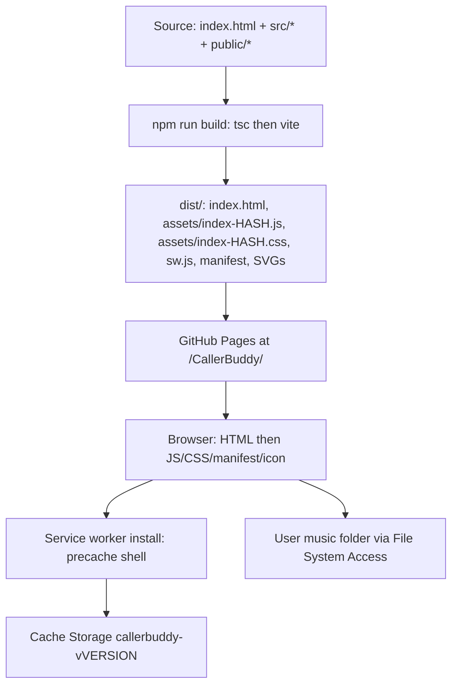
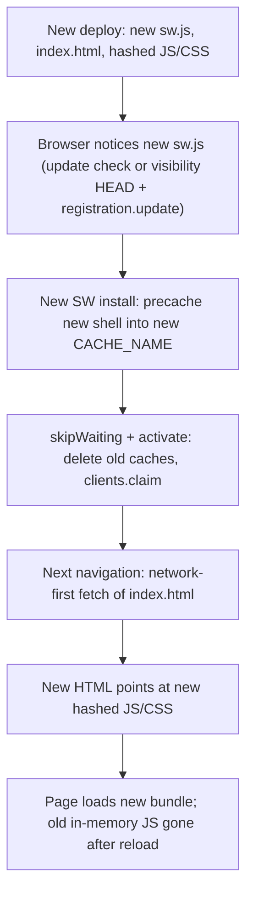

# CallerBuddy: source → deploy → runtime file flow

CallerBuddy is a **Vite-built Progressive Web App**. There is no native installer and no app files written to disk. Typing [https://vancem.github.io/CallerBuddy/](https://vancem.github.io/CallerBuddy/) loads a small static site; a service worker then keeps the app shell in the browser’s **Cache Storage**. Music/lyrics stay on the user’s machine via the File System Access API.



---

## Phase A — Build (source → `dist/`)

Triggered by CI ([`.github/workflows/deploy-preview.yml`](.github/workflows/deploy-preview.yml)) on push to `main`, with `BASE_PATH=CallerBuddy` (the repo name). Locally: `npm run build` (optionally `BASE_PATH=CallerBuddy`).

### Step-by-step

1. **`prebuild` → [`scripts/inject-version.cjs`](scripts/inject-version.cjs)**  
   Writes [`src/version.ts`](src/version.ts) from `package.json` version + git hash (e.g. `0.1.0-pre.240-fc2c0055`).

2. **`tsc -p tsconfig.build.json`**  
   Type-check only (`noEmit: true`). Emits nothing into `dist/`.

3. **`vite build`** ([`vite.config.ts`](vite.config.ts))  
   - `base` becomes `/CallerBuddy/` when `BASE_PATH` is set (so all asset URLs are under that path).  
   - Plugin [`scripts/vite-inject-version.cjs`](scripts/vite-inject-version.cjs) generates `public/manifest.json` and `public/sw.js` from templates, then after bundling rewrites **`dist/sw.js`** with the full precache list.  
   - Bundles the app; copies `public/` into `dist/`.

### Source → distribution mapping

| Logical dist file | How it’s made | Main inputs |
|-------------------|---------------|-------------|
| `index.html` | Vite transforms root [`index.html`](index.html) | Rewrites `/src/main.ts` and `/src/index.css` to hashed asset URLs; prefixes with `/CallerBuddy/` in CI |
| `assets/index-<hash>.js` | **One** minified/bundled JS file (~560 KB) — **yes, almost the entire app** | See breakdown below |
| `assets/index-<hash>.css` | One extracted CSS file (~1.5 KB) | **Only** [`src/index.css`](src/index.css) (global tokens/chrome). Component styles stay inside the JS bundle |
| `sw.js` | Generated from [`public/sw.template.js`](public/sw.template.js) | Versioned cache name + `PRECACHE_URLS` listing HTML + hashed JS/CSS |
| `manifest.json` | From [`public/manifest.template.json`](public/manifest.template.json) | App name, `start_url`, icon → `callerBuddy.svg` |
| `callerBuddy.svg` (and unused sibling SVGs) | Copied as-is from [`public/`](public/) | Not compiled |

### What’s inside `assets/index-<hash>.js` (yes, mostly everything)

Frankly **yes**: nearly all application code and inlined content is dumped into this single file. There is no separate `help-content.md` (or per-component JS) in `dist/`.

**Help markdown specifically:**

1. Source: [`src/help-content.md`](src/help-content.md)
2. At build time, Vite’s [`markdownPlugin`](vite.config.ts) runs `marked.parse(...)` and turns the file into roughly: `export const html = "<h1>Welcome…</h1>…";` (Markdown → HTML string, not shipped as `.md`)
3. [`src/components/help-view.ts`](src/components/help-view.ts) does `import { html as helpHtml } from "../help-content.md"`
4. That import is rolled into **`assets/index-<hash>.js`**. Opening Help just reads the already-loaded string from memory — no extra network fetch for help content.

**Also inside that same JS file:**

- All `src/**/*.ts` reachable from [`src/main.ts`](src/main.ts) (UI components, services, models, utils)
- npm deps: `lit`, `jszip`, `marked`, `soundtouchjs`, `web-audio-beat-detector`
- Lit component `static styles` (CSS-in-JS strings)
- The compiled help HTML string above

**Outside that JS file (small leftovers):** `index.html`, the tiny global CSS file, `sw.js`, `manifest.json`, SVG icons.

**Compilation notes:** TypeScript → JS and CSS are **bundled and minified** by Vite/Rollup. Content hashes in filenames change when content changes (`index-DLW53n7M.js` on live Pages today; a different hash locally is normal). There is **no code-splitting into multiple JS chunks** in practice — one dynamic `import()` exists but does not produce a separate file on disk.

**Not in the distribution:** user music, lyrics, `CallerBuddySongs.json`, playlists — never deployed.

---

## Phase B — First visit (cold load)

What happens when you type the URL (no controlling service worker yet):

| Order | Request | Cause |
|-------|---------|--------|
| 1 | `GET /CallerBuddy/` | You typed the URL. Pages serves **`index.html`** (directory index). |
| 2a–2d (parallel, from HTML) | `assets/index-<hash>.js`, `assets/index-<hash>.css`, `callerBuddy.svg`, `manifest.json` | Tags in the built HTML (`script`, `link stylesheet`, `link icon`, `link manifest`). |
| 3 | Module executes | [`src/main.ts`](src/main.ts) logic: mount `<app-shell>`, `callerBuddy.init()`. |
| 4 | After `window` `load` | `navigator.serviceWorker.register(.../sw.js)` — **not** linked from HTML. |
| 5 | SW `install` | `cache.addAll(PRECACHE_URLS)` into Cache Storage. |

### Precached vs on-demand

**Precached on SW install** (today’s live shape):

```text
"", "index.html", "assets/index-<hash>.css", "assets/index-<hash>.js"
```

That is the complete **app shell** needed offline for UI/code.

**Fetched because HTML/browser asked, but not in the precache list:** `manifest.json`, `callerBuddy.svg` (may be cached later if the SW’s cache-first path sees them).

**On-demand later (not HTTP from Pages):**

- Music / lyrics / ZIPs / `CallerBuddySongs.json` / `CallerBuddySettings.json` — local disk via File System Access API  
- Folder handle persisted in **IndexedDB** (`callerbuddy`)  
- UI prefs in **localStorage**  
- No webfonts — system font stack only  

---

## Phase C — Where files “end up”

Nothing lands in a normal download folder as “the app.”

| Location | Contents |
|----------|----------|
| **Browser Cache Storage** (`callerbuddy-v<version>`) | Precached HTML + JS + CSS; optionally later same-origin assets the SW saw |
| **Service worker registration** | Controls `/CallerBuddy/` scope |
| **OS “Install app” / WebAPK** | Shortcut + install metadata pointing at the same origin (still served/cached by the browser) |
| **IndexedDB** | Music-folder handle, not media bytes |
| **User’s music directory** | Actual audio and lyrics files |

Approx shell size: **~0.56 MB** cached uncompressed; **~0.15 MB** typical gzip transfer for the JS-heavy payload.

---

## Phase D — Same URL again (warm load)

Yes — the browser finds previously downloaded shell files, but **strategy differs by request type** ([`public/sw.template.js`](public/sw.template.js)):

| Request kind | Behavior |
|--------------|----------|
| **JS / CSS** (and other non-navigate same-origin) | **Cache-first** — usually no network if still in Cache Storage |
| **Navigation** (`/CallerBuddy/` document) | **Network-first** (1s timeout) so HTML can refresh when online; falls back to cache if offline/slow |
| **New deploy** | New content hashes + new `CACHE_NAME` → SW update; old cache deleted on activate; new assets precached |

So a revisit does **not** re-download the big JS bundle if the cache is warm and the version unchanged. A version bump forces a new cache and new hashed filenames.

[`src/main.ts`](src/main.ts) also periodically checks for SW updates (`HEAD sw.js` + `registration.update()` when the tab becomes visible).

---

## How new versions are picked up

**Partly via `index.html`, but the real switch is the service worker + hashed asset names.** A version bump (deploy) typically changes all of: `sw.js` (new `CACHE_NAME` + new `PRECACHE_URLS`), `index.html` (new `assets/index-<hash>.js` / `.css` URLs), and the asset files themselves.



**What triggers detection**

1. **Service worker update check** — registration uses `{ updateViaCache: "none" }`, so the browser always revalidates `sw.js` by network when checking for updates (not a stale cached copy of the SW script).
2. **Tab becomes visible** ([`src/main.ts`](src/main.ts)) — if online, `HEAD sw.js` then `registration.update()` to prompt an update check when you return to the tab.
3. **Browser’s own SW update cadence** — also on navigations / periodic checks while the app is used online.

When `sw.js` bytes differ (new version string / new precache list), the new worker **installs**, calls **`skipWaiting()`**, **activates**, **`clients.claim()`**, and **deletes other cache names**. New shell files are already in the new cache from install.

**Role of `index.html`**

- Navigations are **network-first** (~1s). Online, a reload/open usually gets the **new** HTML, which points at the **new** hashed JS/CSS.
- Those new URLs are either already in the new precache or fetched once and stored.
- So yes: picking up the new *UI code* usually happens when the browser loads a fresh document (`index.html` / `/CallerBuddy/`) after the new SW is in place.

**What does *not* happen**

- There is **no** in-app “Update available — click to reload” prompt.
- An already-open tab keeps running the **old JS in memory** until the page is reloaded/navigated; claiming the new SW does not hot-swap the running module graph by itself.
- Offline, you keep the last successfully cached version until you’re online again and an update check + navigation can complete.

**Practical user experience:** ship a new version → user opens/refocuses the app while online → SW updates in the background → next full load of the page uses the new `index.html` and new hashed bundle. Version string shown in the UI comes from baked-in `APP_VERSION` inside that JS bundle.

---

## Airplane mode / “no more network after index.html?”

**Almost — with these caveats:**

1. **App shell is self-contained after a successful first load.** Loading `index.html` causes the browser to pull JS + CSS (+ icon/manifest). The SW then precaches HTML/JS/CSS. After that has completed once, putting the device in airplane mode and opening CallerBuddy again should still show the UI and run the app code from Cache Storage. Music/lyrics are not fetched from GitHub Pages; they come from the user’s local folder.

2. **Not “zero network attempts.”** On later visits, document navigations are **network-first** (try the network for up to ~1s, then fall back to cache). In airplane mode that attempt fails and the cached HTML is used — so it still works, but the browser may briefly try the network. JS/CSS are **cache-first** and normally do not hit the network. Occasional `HEAD sw.js` update checks also fail harmlessly offline.

3. **First visit still needs network.** Airplane mode before the shell has ever been downloaded/precached will not work — there is nothing in Cache Storage yet.

4. **Cloud folders are a separate concern.** If the music library is OneDrive/Google Drive “online-only” placeholders, those files may be unavailable offline even though CallerBuddy itself needs no Pages traffic.

**Bottom line:** After one successful online load (SW installed + shell precached), CallerBuddy’s own code/UI should keep working with no further GitHub Pages downloads. That is the intended offline PWA behavior — not that the browser never attempts a network request.

---

## Approximate `assets/index-<hash>.js` breakdown

Actual Vite bundle today: **~559 KB raw / ~153 KB gzip**. Attribution below is from an esbuild metafile stand-in (~585 KB; same graph, slightly different minify) — good enough for “where’s the weight,” not byte-perfect.

### By bucket (% of attributed bytes)

| Bucket | ~KB in bundle | ~% | What it is / worth it? |
|--------|---------------|-----|-------------------------|
| **`src/components/*`** | **207** | **36%** | Your UI (playlist editor, song play, onboard, app-shell, …). Largest piece; expected for a full app. |
| **`standardized-audio-context`** (+ related) | **~106** | **~18%** | **Transitive** deps of `web-audio-beat-detector` (BPM). Detector itself is tiny (~4 KB); this polyfill stack is the real cost. Biggest “is it worth it?” candidate if BPM is optional. |
| **`jszip`** | **95** | **16%** | ZIP onboarding / import. Large but does a lot of work. |
| **`marked`** | **41** | **7%** | Runtime Markdown→HTML for lyrics (and related). Help MD is compiled at *build* time separately. |
| **`src/services/*`** | **35** | **6%** | Audio engine, library, FS, onboarding, … |
| **`src` root** (`caller-buddy.ts`, `main.ts`, …) | **20** | **3%** | App orchestration. |
| **`help-content.md` (compiled HTML string)** | **17** | **3%** | Embedded help. Cheap. |
| **`src/utils` + models + controllers** | **~22** | **~4%** | Helpers. |
| **`soundtouchjs`** | **13** | **2%** | Pitch/tempo — **cheap for the feature**. |
| **Lit family** (`lit-html`, `@lit/reactive-element`, …) | **~17** | **~3%** | UI framework — **cheap**. |

### Largest individual contributors (illustrative)

- `jszip` ~95 KB  
- `playlist-editor.ts` ~58 KB  
- `marked` ~41 KB  
- `song-play.ts` ~31 KB  
- `song-onboard.ts` ~25 KB  
- `playlist-play.ts` / `app-shell.ts` ~22 KB each  
- `help-content.md` ~17 KB  
- `soundtouchjs` ~13 KB  

### Takeaways for “worth the cost”

1. **Most weight is your own UI + JSZip + BPM’s transitive audio polyfill** — not Lit, not SoundTouch, not help text.  
2. **SoundTouch and Lit are bargains** relative to features.  
3. **Help markdown is negligible** (~17 KB embedded).  
4. **`web-audio-beat-detector` looks small in `package.json` but pulls ~100 KB of `standardized-audio-context`** into the shipped bundle — the main hidden cost.

---

## Dev vs production (same sources, different serving)

| | Dev (`npm run dev`) | Production (Pages) |
|--|---------------------|--------------------|
| HTML loads | `/src/main.ts`, `/src/index.css` live via Vite | Hashed `/CallerBuddy/assets/index-*.{js,css}` |
| SW | Explicitly **unregistered** / caches cleared | Registered; precaches shell |
| Minify | No | Yes |

---

## One-sentence summary

**Source TS/CSS/MD → Vite compiles into one hashed JS + one hashed CSS + rewritten HTML → CI uploads `dist/` to Pages → browser fetches HTML first, which pulls JS/CSS/icon/manifest → JS registers `sw.js`, which precaches the shell into Cache Storage → revisits serve JS/CSS from that cache; music never comes from the URL.**
