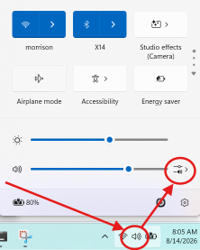
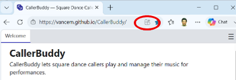
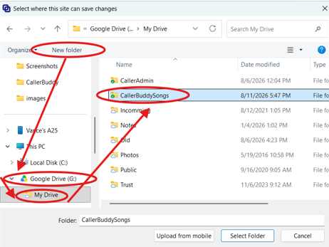
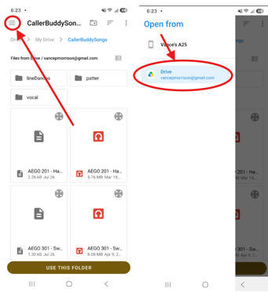
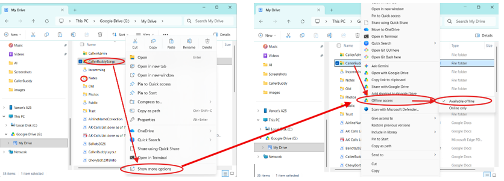
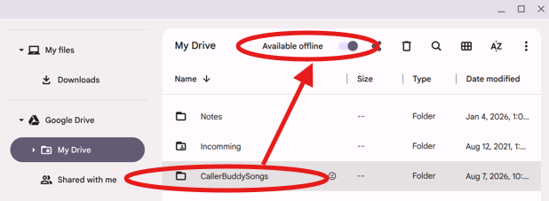
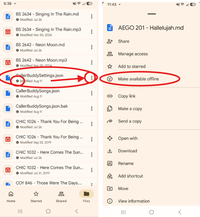
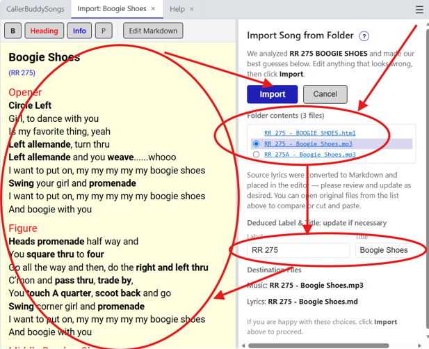

# Welcome to CallerBuddy

CallerBuddy is a web-based program that Square Dance Callers can use to play
music during performances.  Here are some of its key features.  

1. **Browser or App** - CallerBuddy can be used just as a web site in your browser, 
   but it can also be installed as normal desktop app (so you can launch it 
   from your taskbar, or placed on the desktop).
   See [Installing CallerBuddy](#running-callerbuddy-outside-the-browser).
2. **Safe To Run** - You don't need to worry that you are 
   compromising the safety of your machine when you run CallerBuddy because 
   it is only allowed to see files you explicitly enable.  See 
   [CallerBuddy Security](#callerbuddy-security). 
3. **Cloud storage friendly** - You can have your songs 'in the cloud'
   where they are backed up and run CallerBuddy from different machines on that
   one copy of your songs.  See [Cloud Storage](#cloud-storage-for-your-songs).
4. **Works Offline** - CallerBuddy can run without any network connection, 
   so it will work wherever you need to perform.  See [Offline CallerBuddy](#offline-callerbuddy).
5. **Cross Platform** - CallerBuddy works on Windows,
   Macs (with Chrome Browser), Chromebooks, Linux, and Android phones (sadly 
   IPhone does not support all the needed functionality, and is unsupported).
6. **Keyboard Friendly** - CallerBuddy has extensive keyboard shortcuts, that are easy 
   to learn with hover-over help.  You never need to be fiddling with a 
   mouse on stage, or looking for a cursor in sunny conditions. See [Keyboard Shortcuts](#keyboard-shortcuts).  
7. **Touch (Phone) Friendly** - For Android Phones, CallerBuddy is fully touch capable 
   (no keyboard needed) and the user interface 'fits' in the phones screen size.
   Your phone can definitely be your primary tool when giving performances.
8. **Adding Song is EASY** - Sadly, there is no standard way of distributing square
   dance songs.  As a result adding new longs to your library typically is more
   painful that you would like.  CallerBuddy makes this truly easy.
   See [Adding songs to CallerBuddy](#adding-songs-to-callerbuddy)

## Expected Workflow 
### First Time Setup
When CallerBuddy is launched for the first time (or after it is reset from the ☰ menu), 
it will  display a welcome pane that asks the user to create or designate a
 **CallerBuddySongs** folder that will hold songs and the other data CallerBuddy needs.
However when  you relaunch CallerBuddy it will go strait into the 
[playlist editor](#playlist-editor). (On Android, there is
a reconnection process first but you still ultimately end in the playList editor).

## The App Menu

In the upper right corner of CallerBuddy is a ☰ icon that activates a menu of 
operations on CallerBuddy as a whole.   Resetting CallerBuddy, 
[Adding Songs](#adding-songs-to-callerbuddy), 
and Help are in this menu, among other things.  Generally speaking, you will use this
menu rarely.  

## Playlist Editor

CallerBuddy has the concept of a **playList**.  A playList is simply a list songs 
to be performed (probably sequentially) at a dance or workshop.   This lets 
you plan your dance so you are not fumbling for music during a performance.
To keep the flow simple and consistent, CallerBuddy requires a playList to play
even one song, but to allow a song to be played quickly it as a 'Play now'
capability (the ▶ icon, shortcut P), which fuses both adding the song to the playlist and 
playing the song, so CallerBuddy can have the 'feel' of being able to play a single song.

The editor consists of left pane that represents the set of songs in the current 
playlist, and a right pane, which is a table of songs from the **CallBuddySongs** folder.
The song table has the following columns

* **Title** - the title (name) of the song.  This is derived from the song's file name. 
* **Rank** - A number from 0 to 100 representing how much you like the song.  This is
  totally user defined (click on it to update), and defaults to 50.   Typically
  you sort by this to find your most popular songs.  
* **Last** Played - The number of days since CallerBuddy played this song.   Useful
  so you don't keep using the same songs and use every song from time to time.  
* **Played** Average - This is a running average of how many times the song was played
  in the last month.   See [How Played is Calculated](#how-the-played-average-is-calculated).  
* **Categories** - This is a set of user-defined words (click to update) 
   that allow you to group songs
   by a category (for example xmas, or patriotic or holiday).  Since CallerBuddy's text
   filter sees words in the categories column, it can be used to filter by category.  
* **Order** - A number that represents the order this song was added to CallerBuddySongs.
   Sorting by this lets you find your 'new songs'.  
* **Label** - The producer of a song has a short designation (a few letters and a number)
   that uniquely define the producer as well as the individual song.  Some songs do not
   have this, but when they do, sorting by it will allow you to find all the songs 
   by a particular producer (which often have a similar sound or style)
* **Type** - Indicates if the song is patter (no lyrics) or singing call (with Lyrics) 

To help choose a song, you sort by any of the columns above (by clicking on the column 
name), or typing values into the filter textbox or the rank filter at the top of the 
song table.  

* If you type a word in the filter textbox only songs with that text somewhere in the 
  row will be displayed (includes title, category, label and type columns)
* If you type !WORD in the filter textbox only songs that do NOT have WORD will
  be displayed.  (e.g.  !xmas will eliminate the Christmas songs)
* You can set the >= <=  and the value to filter by rank value (thus look at only
  your popular or less popular songs)

You can add songs to the playlist by clicking on the + (or typing +), or by dragging a row
to the playlist area.   When you drag, you can place the song in the order you want
it by finishing the drag at the desired spot.    You can also rearrange songs already
on the playlist by dragging them to the desired spot.   Dragging on Android works, you 
simply touch and hold to start a drag.  

If you right click on a row of a song, all the operations you can perform on the song
are present in a context menu.   To support touch, there is a ⋮ icon at the far right
of each row that also gets you to this context menu.

You can remove items in the playList by clicking the X beside the entry, you can 
remove all entries in the list with the'Clear' button at the bottom

When you are happy with your playlist, click the 'Play' button (or type &lt;Enter&gt;)

## Now Playing

A completed playList moves on to the 'Now Playing' page.  This page represents 
your progress at a single performance.   Each song has a checkbox beside it 
that indicates if it has been played or not, and by default the first unchecked
song is selected. Typing the **space bar**, or  &lt;Enter&gt; or clicking
the 'Play' button will play the selected song.   Thus in a typical dance 
you simply need to keep hitting the **space bar** to play the next song.

However you are free to modify your playlist during the performance. 
You don't have to go in the order you originally specified, simply use
mouse or **up/down arrow keys** to select a different song to play next.  **Double
clicking** on a song will pay that song independently of whether it is next
or has been played before.   If you change your mind and don't want to 
use on of the songs on your playlist, you can check its checkbox (indicating
it has been played) or **hit the X** icon to delete it entirely.  
You can also **drag songs** to reorder them.
Finally you can go back to the playlist editor (using 
the **'Close'** button or the **Esc** key) add more songs to the playlist and then
come back to the playlist editor.   In short you can manipulate the 
playlist pretty much in any way on the fly.  

Often you might practice your performance, and so you will want
to reset the checkboxes back to 'unplayed' after your practice.  There
is a **'Reset'** button for this purpose.  

### The Break Timer

The other piece of functionality on the 'Now Playing' page is the break 
timer.   It is a simple count-down timer that runs after a song has been
played, and will chime when the countdown reaches zero (and then every
30 seconds after that).   You can set the amount of time, and you can 
turn the timer off if you don't need it.   

Finally CallerBuddy will tell you the time that last song ended, so that
even if you don't use the timer, you can know how long the break has been.  

Most times however, you just want to hit the **space bar**, which takes 
you to the song player for the next unplayed song on the playList. 

## Song Player

By default, when the song player is activated, it immediately starts 
playing (because this is almost always what you want).  However if you
did not want it to play you can immediately hit the **space bar** or the 
&lt;Enter&gt; key to pause the music, and type '.' to reset the
music to the start.  

### Controlling Where the Sound Goes
It can be frustrating when you start a audio player and you get 
no sound because it is sending it to some device and you have no
idea where.  The good news is that CallerBuddy inherits the behavior
of the Browser in dealing with sound output.  This means that if you
add a new sound device, like the Browser it will switch to it.   If
for whatever reason sound is still not working you can switch the 
default sound output at the operating system level and CallerBuddy
will switch to it.   On windows this is controlled by a sound icon
which by default is on the right side of the taskbar at the far 
right bottom corner of the screen.  

Clicking on this speaker icon opens a popup, on which there is a line for sound.
Check to make sure that sound is not muted (no X byt the speaker icon)
and click on the devices icon on the right side of that line.
That brings up a menu of output devices, that you can choose from 
to set the output device.  

Another useful tip is to remember that most laptops have function (Fn)
buttons across the top of the keyboard.  Typically there are icons for
muting as well as changing the volume.  Pressing these buttons (or 
pressing the 'Fn' button as you press them), will allow you to unmute
and change the volume.  This can be handy to avoid needing the mouse
during a performance. 

### Song Player Layout
The Song Player is broken into two panes.  The left pane depends on 
whether the song is a singing call (has lyrics) or a patter (doesn't).
The right pane has the main controls for playing a song.  At the
top of the right pane is standard audio controls (play, fast forward 
small, fast forward 
large, skip to end, rewind, rewind large, skip to beginning).   All of 
these buttons have keyboard shortcuts associated with them (hover to 
discover).  Below them are controls for adjusting volume, pitch and temp. 

### Adjust pitch and tempo

The following adjustments are remembered as part of the song so that
they are always optimal for you when you play them.  You should not
have to use these controls most of the time (you set the up once and
probably never touch them again)

* **Volume** (0–100): (v/V keys) This allows you to make sure that all
  songs have roughly the same volume regardless of the level used during recording.  
* **Pitch** (half-steps): (p/P keys) You should adjust each song so that
  it is in a pitch range that is easy for you to sing.   If you have
  to reach for high or low notes, you should adjust the pitch.  Each
  unit of pitch is 1/12 of an octave (the distance between to of any 
  keys (black or white) on a piano).
* **Tempo** (BPM delta): (t/T keys) The number of beats per minute (BPM)
  is displayed on this line.   Generally 126 BPM is a good value for
  square dancing, but a younger crowd may want it faster (e.g. 128 or 129), and 
  an older or inexperienced crowd will want it slower (e.g. 124 or 123)

CallerBuddy keeps track of when songs are played and updates data 
shown in the playList editor with this data.   However if you are
practicing, you probably don't want this data updated.  That is what
the 'practice' checkbox is for.  When you check 'practice' CallerBuddy assumes
any playing is not 'official' and does not update the play statistics.  

If you run CallerBuddy in a browser, it is pretty easy for the window
for CallerBuddy to get 'lost' if you navigate away from it.  If music
is playing while this is happening, it can be very annoying.  By 
default CallerBuddy enables an 'Auto-Pause' feature where CallerBuddy
will stop playing if its window loses focus.  This does not solve the
problem of finding the window again, but it does stop the music, and
allow you to simply open a new version (which remembers where you were
so that you can continue reasonably quickly).  However if you 
are calling over a Zoom connection, Auto-Pause is dangerous because
you expect to move focus back and forth between CallerBuddy and Zoom.
For cases like this there is a checkbox to turn off Auto-Pause.  

At the bottom of the right pane of the song player is a button
for singing calls that invokes the [lyric editor](#edit-lyrics).  Typically
you will want to tweak singing call lyrics to your preferences, and this
allow you to do this quickly and easily.  

### The Song Progress Bar 

Along the bottom of the Song player is a progress bar that shows where
in the song the sound is currently playing.   If you click there 
you can move where the song is playing (useful for practicing a particular
hard part).  The bar is 
divided into 7 equal segments that roughly map into the 7 parts of
a singing call.  When playing a singing call these regions are labeled.
This is quite useful so you can remind yourself which section is
next (it is easy to forget if you get distracted).

When playing patter, CallerBuddy has the concept of looping, and the
end point (in red) and the restart point (in green) are shown on the 
progress bar.  You can drag these to change where looping happens, but
generally you will want to use more precise controls described below.  

### The left pane in the Song Player

When a singing call is being played, the left pane displays the lyrics
for the song, it also becomes the [lyric editor](#edit-lyrics) when
the 'Edit Lyrics' button is pressed.   The lyrics can be scrolled 
using the wheel mouse, the track-pad (two finger slide) or the up/down
arrow keys.  

#### Setting loop points for patter

Patter songs (those without lyrics) automatically show loop
controls instead of lyrics when played. Patter always loops: by
default the loop is the whole file, but typically this is not
ideal because many songs have a intro or trailer that is very 
different than the rest of the song.   Thus CallerBuddy lets 
you set a end point, which will cause the song to wrap to the
start of the loop.   By choosing these points well, you can create a 
seamless loop.   You can use the [progress bar](#the-song-progress-bar) 
to grab the red and green lines to do this, but the fine controls
in the left pane work better.   

A good technique is as follows.   Play the music until you have
identified where is starts the main tune (it has passed the intro).
Look at the 'position' value on the right pane so you know 
approximately where this position is.  Then restart the song 
(typing . will do this, and the space bar will stop it) and 
hover your mouse over the 'Set' button for the loop start.
Let the music play and click the 'Set' button at just the right
time.   This sets the loop start. 

Next go to near the end of the song (just click somewhere near
the end in the progress bar) and listen for a point in the 
music that feels like a good end point.   Rewind a bit and
again be ready to hit the 'Set' button (this time for Loop End)
to set this.

Now typically this gets you close, but not perfect.   What you do 
is click near the end and let it play and listen to the loop
transition.  You will be able to tell if it is too early or late
and use the arrow keys next to the 'Set' buttons to nudge the
loop end and loop start until they are perfect (start with the
big nudges and then use the small nudges)  

Once you have done this a couple times, you can usually set up
a loop in just a minute or two.   Once set, CallerBuddy will
remember across restarts of the app.  

#### The patter timer

Since all patter loops, patter will go on forever, so it is easy to
loose track of how long patter has played.  The 'Elapsed' value
on the right pane will tell you this, but it is useful to have a 
audio reminder.   That is what the Patter timer is for.

Generally 4 minutes is a 'short' patter length, 6-8 minutes is 'normal'
and generally you don't want to go over 10 minutes for any reason. 
CallerBuddy's default is 6 minutes (the short side of normal). 

When the timer goes off it just makes a short chime.  It will
repeat this every 30 seconds (you should be able to resolve in
that amount of time).  You can hit Ctrl-T to disable the timer
if the chime is annoying.  

## Edit lyrics

Typically the lyrics that come with a song are a reasonable starting point
but you often want to change them to fit your style, or to change the
figure used.   CallerBuddy lets you make these changes.   You just
have to press the 'Edit Lyrics' button in the song player.   This changes
the left side pane from a viewer to an editor.  The top of this editor
has a toolbar with 'Save' (Ctrl+S) and 'Exit' (Esc) buttons.  The editor
is very simple and you can select and delete text, insert test as you 
would expect.  There are also buttons in the toolbar for boldfacing 
text, turning it into a section header (large red text) or as Informational
text (smaller blue text).  Generally this is enough.  Just make your
edits, save and exit.  

If for whatever reason this simple editor is not enough, it is possible
to edit the lyrics in their 'raw' format.   In CallerBuddy, the Lyrics 
are stored as text files called 
[Markdown](https://commonmark.org/help/) (*.md files).
These files are JUST TEXT (no highlighting at all) but you use symbols
like *, #, _ and \ to indicate that you want various kinds of formatting.
If you click the 'Edit Markdown' you flip the editor to this mode and 
click 'Edit Formatted' to get back.   You probably won't need this 
capability, but if the formatting editor ever does something weird, you can
fix it by editing the raw Markdown (which is format the lyrics are actually 
stored in).  

### Lyrics Markdown

Here is the subset of Markdown that CallerBuddy supports.  

| Write this                 | What you get              |
| -------------------------- | ------------------------- |
| `# Title`                  | Song title (large)        |
| `## Figure`                | Section heading (red)     |
| `_authorship_` or `*note*` | Info text (blue, smaller) |
| `**call name**`            | Bold                      |
| `\` at end of a line       | Force a line break        |
| blank line                 | New paragraph             |

## CallerBuddy Security

CallerBuddy is what is known as a **Progressive Web Application** (PWA), which
means that it is running as a web page under the control of a web browser and
is given no more permissions than any other web page is given.  This means
it can't affect things outside the browser unless it asks for permission.
The only permission that CallerBuddy will ask for is to access a single 
folder (the **CallerBuddySongs** folder), which starts out empty and CallerBuddy
will fill with music and lyrics and data about CallerBuddy itself (like
the current playList).  Thus CallerBuddy can only read and write things 
in this folder (and sub-folders), and thus is very safe to run.  

You will see this security in action when you first start up CallerBuddy. 
The dialog box that is used to pick this folder is NOT from CallerBuddy, it
is from the browser responding to CallerBuddy's request (Don't blame 
CallerBuddy for its user interface).  Once you have selected a folder 
the browser then brings up another popup to make you confirm that you are
OK granting CallerBuddy the permission to read and write to this folder.
This can feel inconvenient, but it is what allows you to run CallerBuddy
without fear of it being malicious software.  

## Running CallerBuddy Outside the Browser

CallerBuddy is what is known as a **Progressive Web Application** (PWA).  This
is a fancy name for the idea that web browsers are powerful enough
that you can  write what looks and feels like a normal computer application as
an a web page running in the browser.  The most important property of a PWA is
that **it has the security model of a web page**.  A user surfing the web does
not TRUST the web sites he is visiting and so web pages are placed in a
'sandbox' which restricts the page from doing dangerous things (like touching
arbitrary files).   PWA's inherit this security model.   On the plus side it
means that running and installing a PWA like CallerBuddy is not 'dangerous' (it
is highly restricted in what it can do), but on the minus side it is highly
restricted in the files that it can read or write.   Luckily CallerBuddy's main
functionality is to play music and keep track of the music in its own folder set
up for that purpose, which is (barely) within the scope of what a PWA can do.

At is heart, a PWA like CallerBuddy is just a web page and like all web pages it
has a name (URL).  CallerBuddy's is
[https://vancem.github.io/CallerBuddy](https://vancem.github.io/CallerBuddy).
When you open this web page, notice that on desktop platforms there is a install icon
on the right side of the textbox for the web page name (URL). Here it is in the
Microsoft Edge browser: 

On the Chrome browser the install icon looks different (a screen with a down arrow)
but it is in the same spot and works the same.   If you click this install
button the browser will ask you a question or two about how to install it (the
defaults are fine). CallerBuddy can then be launch like any other application
(and you can pin it to the task bar if you like), and it will show up when you 
search your apps.  

On an Android phone the process is very similar but the phone doesn't have the
install icon, so you press the vertical ellipses '⋮' and select the 'Install and
create shortcut' menu item (you may need to scroll) to get at the install functionality.  

### What Installing Does

Installing CallerBuddy as an app does two things. 
   1. It removes the browser box around the CallerBuddy window and browsers
   URL textbox freeing up some room (which is nice).
   2. Makes it easier to launch (It is in the start menu, and you can put it
   on the taskbar).

Note that installing CallerBuddy does not give CallerBuddy any more permission 
than it had when it was run inside the browser.  Also uninstalling CallerBuddy
does **not** touch the CallerBuddySongs folder, so you can freely uninstall
CallerBuddy (like any other app on Windows go to Add and Remove Programs) without
any worry about deleting your songs, or your CallerBuddy settings.   

## Cloud Storage for your Songs

There is a pretty good chance that you are already using CallerBuddy 
with cloud storage.   That is because when you first set up your
your **CallerBuddySongs** folder, you probably the operating system
probably defaulted to creating this in the Documents
folder, and on most operating systems this folder will be set up
for Cloud Storage.  

Since CallerBuddy puts EVERYTHING it needs into the **CallerBuddySongs**
folder this means that everything CallerBuddy needs is already in 
the cloud, which means you can get at it from other computers.  For 
example:
  1. Use [CallerBuddy ](https://vancem.github.io/CallerBuddy/) to set up 
     a **CallerBuddySongs** on one laptop (in the Documents folder or other
     cloud location)
  2. Log in to another laptop and use [CallerBuddy ](https://vancem.github.io/CallerBuddy/)
     to access the **CallerBuddySongs** folder you created on the 
     first laptop from this other laptop.
Indeed in CallerBuddy's initial welcome page, it has a button for 
creating a **CallerBuddySongs** from scratch and another button for 
connecting to a existing **CallerBuddySongs** folder for just this purpose.  

Thus you can get at all your songs from any computer that can get at
your cloud storage.  This includes the songs and lyrics of course but
it also includes all the options you set (volume, pitch, tempo), as well
as songs rank and usage statistics.  It will also remember your preferences
(like how long your break timer is), and what your current playlist is.  

### Run only one CallerBuddy at a time

This is all great, but is is important to realize that CallerBuddy is
really not expecting two versions of the program to be running simultaneously.
CallerBuddy won't let files be corrupted, but if two programs are running
and modifying the same things (like the settings, or playlist) it is 
possible that one copy will overwrite what the other copy changed 
in surprising ways (typically it will look like you lost changes).  The 
simple advice is to avoid letting more than one copy of CallerBuddy run at once.  If 
you leave one copy running at home and then start another at a performance, 
that is OK, but when you get back home you should probably restart it so
it does not try to write anything that would clobber changes you made at
your performance (like what songs were played).   

### Cloud Storage and the Android Phone (Google Drive)

CallerBuddy work quite well on Android phones (unfortunately IPhone only
half-heartedly supports PWA apps and CallerBuddy does not work).  However,
Android's support for PWA apps does not include support for Microsoft's 
One Drive cloud (which is what is used by default on Windows machines).
On the other hand, Microsoft Windows (and Mac) DOES have support for Google Drive.
Thus if you wish to have a single place in the cloud that all of your
devices (Windows, Android phone, Chromebooks, Macs), can access, you should
use Google Drive.  If you will only be using CallerBuddy on Windows, then
you can simply leave your **CallerBuddySongs** folder in the Documents folder
(effectively using Microsoft One Drive to store your songs in the cloud).
If you use cloud storage, however please see the 
[Offline CallerBuddy](#offline-callerbuddy) section to make sure that 
CallerBuddyWorks when you don't have network connectivity.

#### Using Google Drive from All Platforms

The main reason you would want to install google drive is so you can access
the same files on your Android phone and your laptop computer.   This means
you already have Google account, and it is already set up on your phone.  This
simplifies the steps need to the following. 

 *  On the desktop, go to [Google Drive Install](https://support.google.com/a/users/answer/13022292?hl=en) and install the Google Drive. 
 *  Launch Google Drive, and sign into your account.  

 Once you do this, whenever you are choosing files you will see an additional
 top level 'Google Drive' option in the left pane.    For example here is 
 what the folder chooser looks like in CallerBuddy, if GoogleDrive is installed 
 on the machine. 

Thus when running creating a **CallerBuddySongs** folder you can simply create
the folder underneath the Google Drive (Under the Google Drive is always a 'My Drive'
folder, put it in that folder (or its subfolders)).

Note that don't have to start from scratch.  If you already have **CallerBuddySongs**
folder set up somewhere else (e.g. Documents), you can simply use the file explorer 
to move this folder from wherever it was to somewhere under GoogleDrive -> My Drive.
CallerBuddy really does not know or care exactly where the **CallerBuddySongs** folder
lives, it just needs access to it.  

Once you have your **CallerBuddySongs** on your Google Drive you can start up 
CallerBuddy, and set the **CallerBuddySongs** folder on the phone to the location on
the Google Drive (Use the Reset CallerBuddy on the ☰ menu if needed).  Unfortunately 
the folder chooser on Android hides the Google Drive so finding your Google Drive
is harder than it needs to be.   As shown below, when choosing a folder
you must activate the ☰ menu in the upper left corner, and then you can choose
the Google Drive and then locate your **CallerBuddySongs** folder. 

At this point you are set up.  You now have a folder that is equally accessible 
from Android Phones, Chromebooks, Windows or a Mac.
But you still need to do the do the setup in [Offline CallerBuddy](#offline-callerbuddy) 
to make sure it work without the network.  

## Offline CallerBuddy

By default, CallerBuddy is designed so that all its non-setup functionality works
offline.   This is true whether CallerBuddy is being run in the browser or as a
app outside the browser.    However CallerBuddy DOES need to get at files in the
**CallerBuddySongs** folder and if that folder lives in the Cloud, then by default
you will need to have network access to get at these files.   One way of solving
this is to simply put your **CallerBuddySongs** folder in a non-Cloud folder.
However if you do this, your songs will only be accessible from that particular
machine and they will not be backed up, so you could lose data if your hardware
fails.   This NOT recommended. 

Instead, both Google Drive and Microsoft One Drive have the notion of a 
file that is 'available offline'.  If this is set on a particular file or folder 
then the cloud Drive software keeps a local copy on the local machine so that
you can access the file without a network connection.   This is not the default,
however, so we need to set it.   To do this, bring up your file explorer application
and select the **CallerBuddySongs** folder.  On windows they hide the offline capabilities.
You have to right click -> Show More Options -> Offline Access -> Available Offline. 

On ChromeBook, their file explorer app displays the offline capability as a switch at 
the top of the display that can be turned on and off for the selected folder/file
at the top of the display.

On Android Phone, you access the Offline capabilities through the Google Drive application
available for free on the Android Play Store.  This app acts very much like a 
file explorer.  **Inexplicably** and **unfortunately** it does not allow you to 
set a folder offline (like we did on both windows, and chromebook and mac) but 
you CAN set individual files as offline.   Thus to achieve this effect, you must 
do it one by one.  For every file click on the ⋮ on the right side, and then 
select 'Make available offline' item.
The example below shows this for the CallerBuddySettings.json file. 

You know you have succeeded on any particular file because there is a dark circle 
with a check inside it that indicates that is available offline (circled in red on
the left side above).   Note you don't
need to do the files for every song (as long as you don't need them offline), but 
you DO need the CallerBuddy*.json files show above.  These are where CallerBuddy
stores the Settings and Song information that CallerBuddy needs to do just about
anything, so of they are not available offline, CallerBuddy will fail/hang.  See
[how CallerBuddy stores data](#how-callerbuddy-stores-the-data-it-needs).  

### Offline Workflows

Offline files work quite well.  You have ONE copy that is logically in the cloud
but is available from any machine.  You always get the up to date copy (logically
there is only one), and you get backup for free (because local copies exist on
all your machines (as well as the cloud)).   

Offline files do have a problem if two different machines are offline and each
modify the same files while offline.   There is no perfect solution here.
The software will bring up user interface and ask you to chose a winner
(some edits will be destroyed).   This is unlikely, but you can make it 
**impossible** by ensuring that you don't leave CallerBuddy running on 
different computers.   That way it is very easy to make sure that only one
copy of CallerBuddy is every running at any one time, and if this is true
the files in **CallerBuddySongs** will never run into the situation that 
creates a conflict.   This is the recommended workflow.  

## Adding Songs to CallerBuddy

Most Square dance callers buy the music online by using a site like
[Music for Callers](https://musicforcallers.com/) to find the web site
of music producer (like Rhythm, Blue Star, Royal, ESP, or Riverboat ...) where 
you can browse and buy one or more songs.   Unfortunately although there
are **rough** standards about what you get when you purchase a song, there is
still **a lot** of variability.   Typically every producer 

1. Provides a *.MP3 file reprensting the music of the song. 
2. Songs typical have what is called a Label which is usually a small
   number of letters (typically < 5) and a number (typically < 3). 
   This identifies the producer as well as a unique number for the 
   particular song.   
2. If it is a singing call provides *0something** that represents the lyrics.
3. Packages it up in a *.ZIP file that you download after your purchase.  

Unfortunately, that is where the commonality ends.  

* Sometimes there are sub folders in the ZIP files that organize
  the lyrics and music, and there is a lot of variability.  
* The file name for the *.MP3 files are often LABEL - TITLE, but 
  some produces reverse that order or don't use a -
* Lyrics are sometimes in HTML, sometimes PDFs sometimes DOCX
  files sometimes several of the above.
* The formatting for the lyrics (what is in the HTML or PDF, or
  DOCX) varies dramatically, and often contains large optional
  things like images or logos.  
* Sometimes the producers provides several variations of the 
  music (with harmony, with leads, keyed for males or females, ...) 
  and the naming conventions for these variations are unpredictable.  
* Sometimes the lyrics are in the same folder as the music, 
  sometimes named the same, sometimes not.  

Basically it is a mess.  At the very least it means your lyrics
format will vary from song to song, and it makes editing the song 
needlessly difficult (most give up).  Caller schools often have 
a session just on dealing
with these types of problems because new callers run into these
issues early and often.  

CallerBuddy solves this by creating a wall between itself and
the music.  On one side of the wall, everything is clean and
clear 

  1. Music is stored in *.MP3 files
  2. The name of this file is LABEL - TITLE.MP3.  A song
     does not need to have a label, in which case a song
     looks like TITLE.MP3. 
  3. If the song is a singing call the lyrics are stored as
     a [Markdown](https://commonmark.org/help/) file.  
  4. The lyric file has the same file name as the music
     with the .MP3 changed to .MD

That is it, and that is what is put into the **CallerBuddySongs** 
folder.  It is all very simple and clear.
[Markdown](https://commonmark.org/help/) was chosen because it is just text
(and any text editor can view and modify it), and it is very simple, so
it is relatively easy to convert things to markdown because you can 
scrape the text from the source and add any [formatting](#lyrics-markdown)
with a tool or text editor.  This allows CallerBuddy to keep the 
formatting of every song consistent regardless of who produced it. 

So in theory anything that puts a *.MP3 file and a *.MD file into
the **CallerBuddySongs** folder will keep CallerBuddy happy.
CallerBuddy will naturally find it, and incorporate into the songs
presented to the user.  If you delete a song, CallerBuddy will notice
that and remove the song from the view.   It does not take much
to keep CallerBuddy Happy.  

### Importing songs

But CallerBuddy can do more.  If you give it a ZIP file, it can look 
inside it and try to figure out in much the way a human would which
file iYs the music file you want, which file has the lyrics, and convert
the lyrics for Markdown for you.   In other
words, it can do most of the work. It is important to note however,
that CallerBuddy can't be
sure it got this right.  So it is pretty important that CallerBuddy
show you what it did and give you an opportunity to fix it in 
pretty much any way necessary before allow you to commit 
the result to the **CallerBuddySongs** folder.  

So the process of Importing involves three steps

1. You give CallerBUddy the name of a ZIP file or a Folder containing the 
   distribution that you got from the song's producer.  CallerBuddy
   will analyze it, do lyric conversion and show it its suggestion.
2. You look over what CallerBuddy is suggesting.   If there is more than
   one variation of the song, you can listen to the other variations.
   You can look at the lyrics that CallerBuddy converted, and you can
   look at the original files to see if anything was lost or garbled. 
   The user interface allows you to fix pretty much anything (which
   MP3 file is chosen to be the music, what the title
   and label will be, and exactly what the lyrics are.   
3. Hit the import button which will copy the *.MP3 and *.MD files 
   into the playlist editor folder you were viewing when you started
   the import.  (The Import menu items are only available while a
   playlist editor is the current window, so the destination is always
   that editor's folder.)  

#### Walking through an Example

This is what it looks like in practice.  When you buy a square dance
song on the internet is always comes as a ZIP file.   It is good practice
to save these originals in case you want to listen to the vocal tracks
or want to use a different music variation.  You could save them as
the original ZIP, or you could unpack the ZIP files into a folder.  
The size difference between these two choices is small (because MP3 files 
are already compressed) so I personally unpacked the ZIP files into 
folders (before CallerBuddy you pretty much had to do this since all
other software will not take the raw ZIPs).  

Since I was in the playlist editor looking at the folder I wanted
the song to live in, I opened the App ☰ menu and selected the
'Import from Folder' option.
If I had stored my purchases as ZIP files I would have simply chosen 
'Import from Zip' instead).  I then navigated to the folder where
my song was (in the case Boogie Shoes) and clicked OK.
CallerBuddy then returned the following screen:

Notice that it lists all the files in this folder (or ZIP) and they
all hyperlinks (which mean I can click on them to open them).  Thus 
I could open the HTML file and look at it.  I notice there are two
mp3 files, one with a 275A and another with just 275, and notice
that CallerBuddy has selected the 275 Version .  I can listen
to the 275A version by clicking on it.  The 275A song happens to be
the version with Wade Driver singing, so I decide that I am happy
with the choice CallerBuddy made to choose the other one.
If I had wanted the other I 
would simply click on the radio button for that file to select it instead.  

I then look lower down to see what it deduced for
the label and title (and thus what the names of the two output files 
are).   These also look good.  

So I move on to looking at the [lyric editor](#edit-lyrics).  I can 
modify anything in this view as well as look at the Markdown if I 
want.  I can open the *.HTML file using the hyperlink and compare 
them if I wanted.  I could cut and paste things from the 
original if I needed, but in
this case (as is typical) CallerBuddy did a great job, so I am happy
with it and so all I have to is press the 'Import' button.

And that is it.  This new song is now in the folder I was browsing
in the playlist editor, and ready for me to use.  It took longer
to navigate to the folder to import that it did to become happy with
the result and finish the importation process.  Adding songs has never
been easier.  

If at a later point I realized I really did want to use a different
MP3 file, or I want to start over with the lyrics, I simply import
that song again, and make different choices.  CallerBuddy will warn
me that I am overwriting my previous work, but I can force that
overwrite, and use my new importation.  

## SubFolders in CallerBuddy

Storing all your songs in the single **CallerBuddySongs** folder is frankly
a very good option, and indeed is the best option if you only have a few
dozen songs in your library.    The filtering feature does let you search
quickly for a particular title, or by type (Patter or Singing), and if you
add Category attributes to your songs (e.g. xmas, or patriotic), you can 
quickly find interesting groups to choose from.    

CallerBuddy does support sub-folders under **CallerBuddySongs** but putting
songs into sub-folders comes with disadvantages.   When you search, you only
search the current folder, and so when you put songs in multiple folders 
hou can lose track of where it is without an easy way of finding it again except
by manually searching.    Thus categories might make more sense.  

But there are times with using sub-folders is superior (basically when there
is NO ambiguity where the song should live, so it is impossible to lose it).  
Examples include

  * If you make a patter folder, you segregate your patter from your singing
    calls (Because when you are looking for one, songs of the other type
    are just 'getting in the way').  This has the added advantage that you can
    use the same song both as a singing call (where you put lyrics), and as
    patter (where you do not).

  * You might make an 2ndTier folder where you put songs that you probably wont
    use (thus they are clutter most of the time), but you have not made the final
    decision to simply delete it.  

  * Is you are a Caller-Cuer, you may wish to segregate all your Cuer songs into
    their own folder (again because when you are looking for one type of song
    songs of the other type are just noise)

To support folders CallerBuddy 

 * The ☰ menu has a 'Create Folder' item for making a new folder.
 * Once a folders exist, it is displayed with a folder icon so you can open it.
 * Open folders have their own tab.  Thus you can click on the tab to go bach 
   and forth easily (the back and forward buttons (Ctrl+< Ctrl+>) also work). 
 * When you import a song, it imports into the currently active folder.  
 * CallerBuddy supports a right click (or ⋮) menu to rename a song
   and as part of this renaming you can move it to a new folder.  

In short, folders work like you probably expect they do.  You can move songs
around outside of CallerBuddy using the OS file explorer and CallerBuddy will
notice that things were deleted and new thing created, but it will not 
recognize that something as moved, which means you lose the extra information
about the song not stored in the music and lyrics files.  

# Appendix 

## How CallerBuddy Stores the Data it Needs

CallerBuddy was carefully designed to keep its data needs **clean** and very 
simple.  CallerBuddy only needs access to a single folder which can be 
called whatever you like but here we called it **CallerBuddySongs** (and we
recommend that name because it is very descriptive).  As mentioned 
in the [Import Section](#importing-songs) the music associated with the 
song is a *.MP3 file and if the song has lyrics (it is a singing call) 
it also has a [Markdown](https://commonmark.org/help/) file with the MP3 suffix
replaced with *.MD.  This is most of the data CallerBuddy needs.

However CallerBuddy also has to store three more pieces of information
 1. ***Browser Context** - CallerBuddy saves the handle 
    for the **CallerBuddySongs** folder
    in a database that the browser maintains.  This is how CallerBuddy
    can avoid prompting the user each time it restarts.  Once the 
    browser has checked that the user authorized access to this folder
    CallerBuddy can keep using it (even across restarts) so further prompting
    of the user is unnecessary.   On Android the rules are different. There
    CallerBuddy still saves the handle, but Android forces CallerBuddy
    to refresh it which is why CallerBuddy shows a 'Reconnect' page 
    on startup on Android.   Thus starting CallerBuddy on Android will
    always be a bit less convenient (two more taps).    
 2. **Song Data** - CallerBuddy has non-lyric-music information 
    about songs that it needs to store somewhere.
    This includes the volume, pitch and tempo settings,
    but also when the song was last played, what its weighted 
    average is, its loop settings, it's rank and categories.  This is all
    stored in a file called **CallerBuddySongs.json**.  Like all
    [JSON](https://simple.wikipedia.org/wiki/JSON) files, this file
    is a **text** file that can be viewed and edited with a normal
    text editor (but please don't, you may make it unreadable to CallerBuddy).
    Logically **CallerBuddySongs.json** is a list songs where each song is
    a list of key-value pairs holding information. 
    This data is **not** touched when CallerBuddy resets.   Because
    this data is precious, every few days, CallerBuddy makes a copy
    of it called **CallerBuddySongs.json.bak**.  CallerBuddy does nothing
    with this file except create it.  The idea is that if something went
    wrong and CallerBuddy corrupted this json file, you could copy the 
    backup file onto **CallerBuddySongs.json**, and only lose a few days
    of modifications to your songs (rather the all the settings you laboriously
    generated over weeks or months)
 3. **App Data** - CallerBuddy also need a place to store things 
    that are not per-song but global to the whole CallerBuddy app.
    This includes things like user preferences (e.g. length of
    timers), the current playlist, and which songs in the playlist
    have been played so far.   This data is stored in another
    [JSON](https://simple.wikipedia.org/wiki/JSON) file called 
    **CallerBuddySettings.json** Note that this file **is deleted** when 
    CallerBuddy is reset, because generally this data is the kind of thing
    that the user is expecting to reset, and is pretty easy to replace.

  That is the complete summary of the data that CallerBuddy manages.
  Note that if the **CallerBuddySongs.json** is not present
  CallerBuddy will create a new one from scratch using the songs that
  are present in the folder.   Obviously it will use defaults for things
  it can't reconstruct (like rank, categories, tempo, pitch, loop points etc),
  but it will be perfectly functional (song preference would have to be 
  reconstructed, which is why we have a **CallerBuddySongs.json.bak**) to
  avoid that loss.  

## How the Played Average is Calculated
Each time a song is played we need to update the 'Played' average to take
the new data into account.  

The first step in this is to determine what counts 
as being played.   When the Song player exits and 

  1. Practice mode is not turned on.
  2. The elapsed time the song played (pauses don't count) is at least
     90% of the length of the song, then the song is considered played.  
     This can mean that short patters might not count as being played.  

Every time a song is played, the Last Played time for that song is updated.  
It then checks if it has already done this for this calendar day, and if 
so it does NOT update the weighted average (thus the weighted average is
only updated at most once a day)    The weighted average is what is know 
as a exponential sliding window with an increment of 1 and a  half life 
of 28 days (1 month).  

THe key thing to remember, however is that when this value is > 1 you 
are probably using it too frequently (fast than once a month), and if
it is < 1, then on average you are using it less than once a month.  
The average is a pretty good measure of how 'popular' the song is
(if A is bigger than B, then A on average has been used more (in the 
recent past) than B).   This is usually enough to decide if you are
overusing or underusing a particular song.  

## Keyboard Shortcuts
### Global (all views)
| Key              | Action                   |
| ---------------- | ------------------------ |
| Ctrl+]           | Next tab                 |
| Ctrl+[           | Previous tab             |
| Ctrl+< or Ctrl+, | Go back (tab history)    |
| Ctrl+> or Ctrl+. | Go forward (tab history) |
| Ctrl+W           | Close current tab        |

### Now Playing shortcuts
| Key           | Action                            |
| ------------- | --------------------------------- |
| Enter / Space | Play selected song                |
| Ctrl+R        | Reset played status for all songs |
| S             | Start/stop break timer            |
| Esc           | Close Now Playing tab             |

### Song Player shortcuts
| Key       | Action                                                                  |
| --------- | ----------------------------------------------------------------------- |
| Space     | Play / Pause                                                            |
| ←         | Back 2 seconds                                                          |
| →         | Forward 2 seconds                                                       |
| Ctrl+←    | Back 5 seconds                                                          |
| Ctrl+→    | Forward 5 seconds                                                       |
| Home      | Restart song                                                            |
| End / Esc | Close player, return to playlist                                        |
| v / V     | Volume down / up (by 5)                                                 |
| p / P     | Pitch down / up (by 1 half-step)                                        |
| t / T     | Tempo down / up (by 1 BPM)                                              |
| Alt++     | Lyrics text larger (~10%; plus / = key, not Ctrl — avoids browser zoom) |
| Alt+−     | Lyrics text smaller                                                     |

### Loop Controls (patter songs, when focused)
| Key             | Action                                      |
| --------------- | ------------------------------------------- |
| ← / →           | Nudge ±10 ms                                |
| Ctrl+← / Ctrl+→ | Nudge ±100 ms                               |
| Enter           | Set loop point to current playback position |

